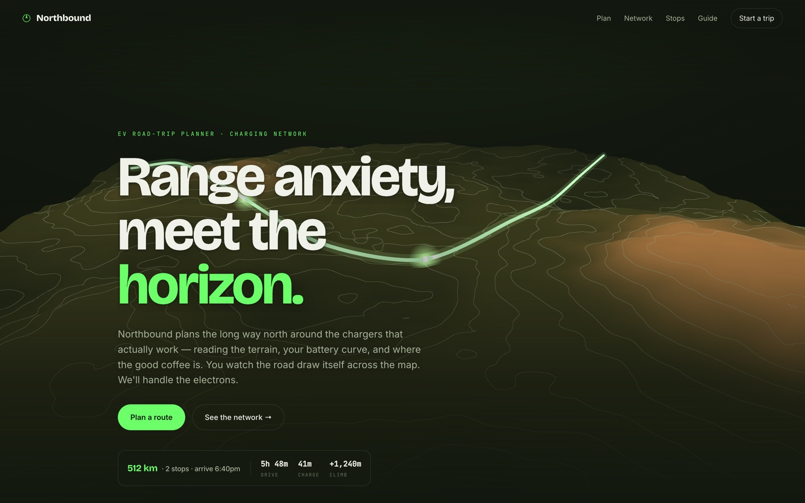

<!-- parable:beautified -->
<div align="center">

<h1>Northbound</h1>

<p><strong>EV road-trip planner — three.js topographic terrain + kinetic route.</strong></p>

<p>
  <a href="https://bswxyz.github.io/northbound-ev/"></a>
  
  
  <a href="LICENSE"></a>
</p>

<p>
  <a href="https://bswxyz.github.io/northbound-ev/"><b>Live demo</b></a>
  &nbsp;·&nbsp;
  <a href="https://bswxyz.github.io/northbound-ev/guide/">Build notes</a>
  &nbsp;·&nbsp;
  <a href="https://parable-three.vercel.app/templates">More templates</a>
</p>

<a href="https://bswxyz.github.io/northbound-ev/">
  
</a>

</div>

**Use this template** — copy the source into a new project:

```bash
npx degit bswxyz/northbound-ev my-app
```


An EV road-trip & charging-network planner landing site with a three.js topographic terrain that a
glowing route line draws itself across — part of the [Parable 25 design showcase](https://parable-three.vercel.app).

---

## Concept

Northbound plans long EV road trips around the chargers that actually work. Where every routing app
shows a flat 2D map with pins, Northbound makes the **landscape** the hero: a 3D contour terrain with
real elevation, a route line that draws itself across two ridges, and pulsing charging nodes at the
stops. The product's pitch — *"Range anxiety, meet the horizon."* — is that the number you care about
isn't distance, it's **the battery you'll arrive with**, and that a charge stop is 20 minutes you should
spend somewhere worth pulling over for: good coffee, a short trail, a fast plug. Adventurous, but
calm-competent; aimed at people who'd rather drive the pass than the interstate.

## Design system

- **Palette (forest ink):**
  `--bg:#12180f` forest ink · `--panel:#1a2115` raised surface · `--ink:#f0f2e9` bone ·
  `--dim:#a7b199` sage · `--faint:#69735c` lichen (mono micro-labels only) ·
  `--green:#6cff6a` electric route accent · `--earth:#c98a4b` clay/trailhead ·
  `--line:rgba(240,242,233,.10)`. Green is the single hero accent — it's the route and nothing else
  on the terrain is green, so the line reads as electric against the earth-toned topography.
- **Type:** `Bricolage Grotesque` (characterful grotesque — display + big numbers) · `Inter` (UI/body) ·
  `JetBrains Mono` (coordinates, kW, range figures, kickers). One face for voice, one for control, one
  for instrumentation.
- **Signature motion:** a custom "crest" easing `cubic-bezier(.2,.9,.24,1)` (quick lift, long settle)
  used throughout, plus an overshoot `cubic-bezier(.34,1.32,.5,1)` for marker pops; a clipped-line hero
  intro; the self-drawing route; and a scroll-advanced camera down the corridor.
- **Signature technique:** a three.js 3D topographic heightfield (procedural fractal noise + Gaussian
  ridges) with an elevation-contour shader, a `TubeGeometry` route that reveals via animated draw range,
  pulsing charging-node sprites, and a scroll-driven camera. Reduced-motion / no-WebGL → a static SVG
  topo map with the route already drawn.

## Stack

- **[three.js 0.160](https://threejs.org/)** (ES-module CDN via import map) — terrain, route tube,
  charging nodes, camera. Loaded through a guarded dynamic `import()`.
- **Plain HTML / CSS / vanilla JS** — no framework, no build step, no bundler. Reveals, animated
  counters, the range ring and the interactive corridor planner are all native
  `requestAnimationFrame` + `IntersectionObserver` + CSS transitions.
- **Inline SVG** for the fallback topo map, the range ring, and all iconography (no image files).

## Running locally

No install. Any static server works because every path is relative:

```bash
git clone https://github.com/bswxyz/northbound-ev
cd northbound-ev
python3 -m http.server 8825      # or: npx serve .
# open http://localhost:8825
```

There is nothing to build. The three.js import map resolves from jsDelivr at runtime. Edit
`index.html` / `styles.css` / `main.js` and refresh.

## Structure

```
index.html          the page (semantic sections; .js gate for progressive enhancement)
styles.css          all styling — design tokens live in :root at the very top
main.js             reveals, counters, range ring, corridor planner, and the three.js terrain
guide/index.html    the "how it was built" write-up (self-contained, styled to match)
.nojekyll           tells GitHub Pages to serve files as-is
LICENSE             MIT
```

Design tokens: `styles.css` `:root`. The terrain (noise heightfield, contour shader, route curve,
node markers, camera choreography) lives in `main.js` under `initTerrain()`. The three route corridors
are the `ROUTES` object in `main.js`.

## Demo vs. real — what a production version would need

This is an intentionally-scoped demo. What's **mocked/modelled** today:

- **No real routing engine.** The three corridors, distances, drive times and arrival times are authored
  sample data, internally consistent but not computed. A real product needs a graph router with live
  traffic, road grades and vehicle-specific energy models (à la A Better Route Planner).
- **No live charger data.** Networks, kW, connector types and "n of m available" are illustrative. Real
  availability needs OCPI/network feeds (Electrify America, Tesla, ChargePoint, etc.) and reliability
  scoring from historical session data.
- **The range ring is illustrative.** "62% on arrival" is a designed figure, not the output of a battery
  charge-curve / consumption model. Real arrival-SoC prediction models pack chemistry, temperature, HVAC
  draw, elevation and wind.
- **The terrain is procedural, not survey data.** It's fractal noise shaped into ridges for the demo — a
  real map would drape the route over DEM elevation tiles and actual road geometry.
- **No accounts, vehicle profiles, payments, or turn-by-turn.** A shipping app needs car/connector
  profiles, saved trips, in-app charging payments and live navigation.

What's **real** and reusable as-is: the three.js terrain + self-drawing-route technique, the WebGL
feature-detection and SVG fallback, the charge-stop-timeline and route-summary UI, the interactive
corridor planner (data-driven re-render), the range-ring component, animated counters, and the full
responsive / reduced-motion / keyboard-accessible layer.

## License

[MIT](LICENSE). Design & build by **Parable**. All visuals are procedural or
hand-authored SVG — no image generation.
